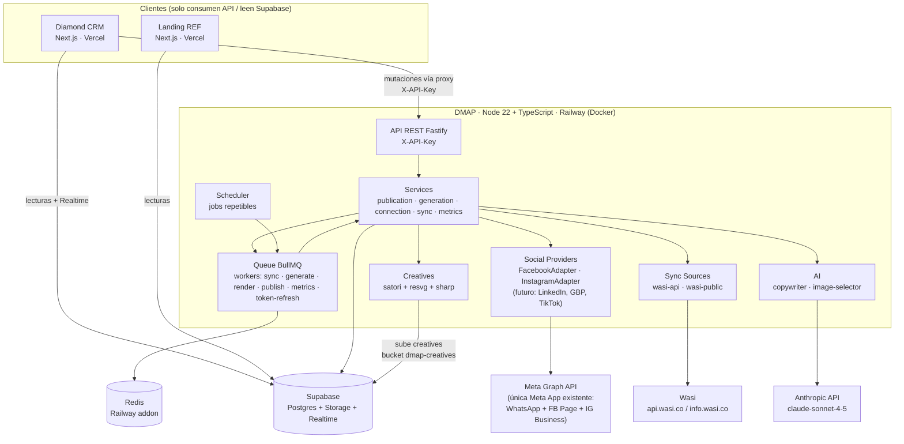
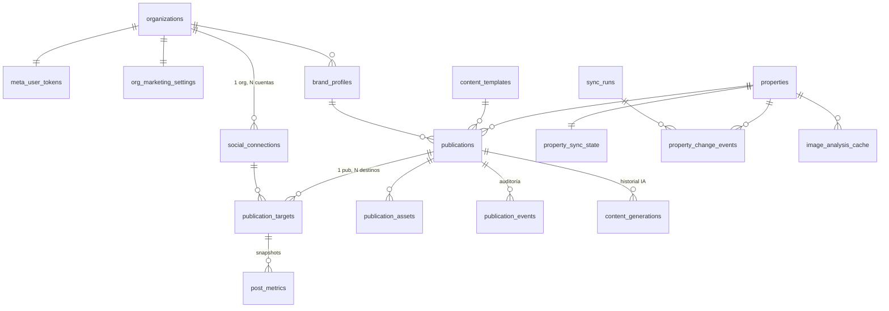
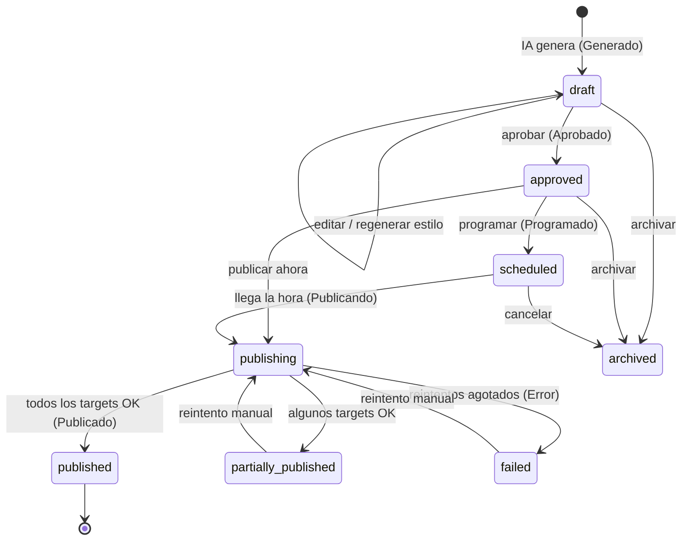
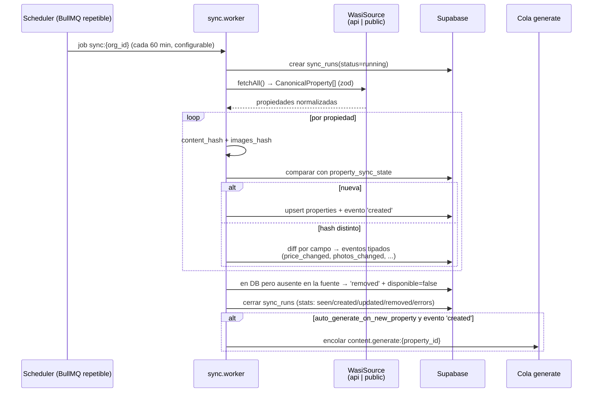
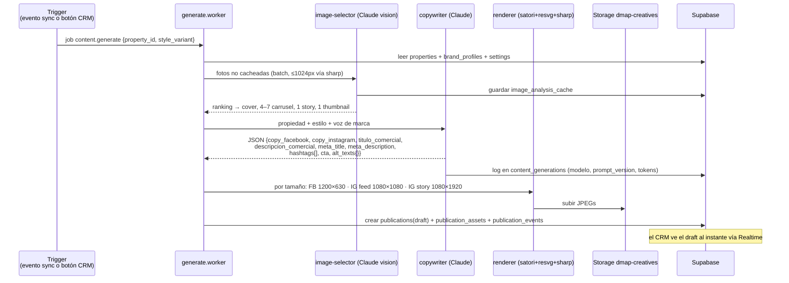
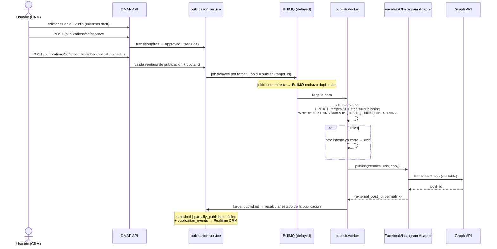
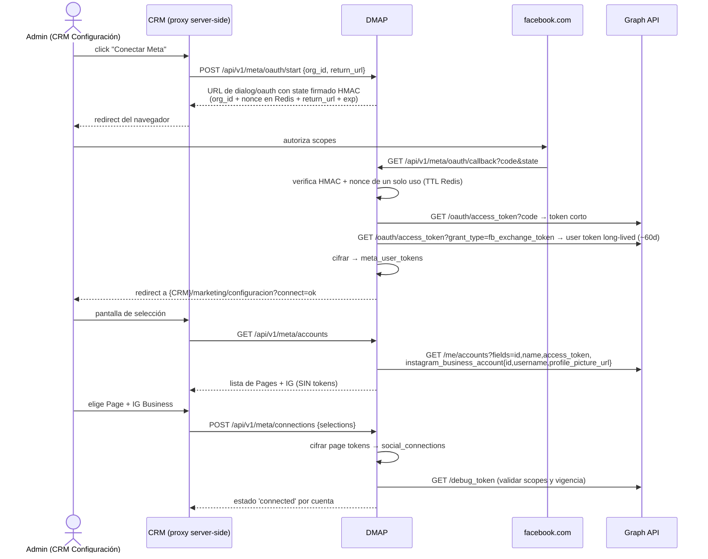

# DMAP — Diamond Growth Engine

## Arquitectura del servicio · Fase 1

> **Estado**: propuesta para aprobación. No se escribe código de implementación hasta que este documento sea aprobado.
>
> Documentos relacionados: [ARCHITECTURE.md](../ARCHITECTURE.md) (bot Sofi) · [crm/ARCHITECTURE.md](../crm/ARCHITECTURE.md) (CRM) · [db/schema.sql](../db/schema.sql)

---

## 1. Visión

DMAP (Diamond Marketing Automation Platform / **Diamond Growth Engine**) es un **microservicio independiente** que convierte el inventario de Wasi en publicaciones de redes sociales listas para aprobar y publicar:

```
Nueva propiedad en Wasi
  → Sincronización automática con detección de cambios
  → IA genera copys (FB, IG, título, meta, hashtags, CTA, alt-text) en 5 estilos
  → IA selecciona las mejores fotografías
  → Se generan creatives con branding Diamond (post, feed, story)
  → Vista previa editable (Content Studio en el CRM)
  → Aprobación humana (nunca auto-publica)
  → Programación
  → Publicación en Facebook + Instagram
  → Recolección de métricas
```

**Principios no negociables:**

1. **Nunca publicar sin aprobación humana.** El flujo `generado → preview → aprobado → programado → publicado` es obligatorio.
2. **Multi-tenant desde el día 1.** Toda tabla, cola, credencial y configuración cuelga de `org_id` (`organizations` es la raíz de tenant, igual que en el bot).
3. **Nada fuera de `providers/` conoce Meta.** Capa de abstracción `SocialProvider` con adapters; mañana se agregan LinkedIn, Google Business, TikTok o Pinterest sin tocar el resto.
4. **CRM y Landing son solo clientes.** No ejecutan colas, workers, schedulers ni tocan tokens.
5. **Tokens siempre cifrados en reposo.** Nunca en texto plano, nunca en logs, nunca en respuestas de API.

---

## 2. Diagrama general



El bot Sofi (Express, mismo repo, servicio Railway aparte) no cambia: comparte únicamente la base Supabase. A futuro, DMAP le pasará contexto de campaña a Sofi (UTM → conversación personalizada), pero eso es Fase 2.

---

## 3. Estructura del servicio

Carpeta `dmap/` en este monorepo, desplegada como **segundo servicio de Railway** con Root Directory `dmap/` y watch path `dmap/**` (el bot sigue desplegando desde la raíz).

```
dmap/
├── Dockerfile                     # node:22-slim multi-stage (build tsc → runtime)
├── package.json                   # "type": "module" — ESM + TypeScript
├── tsconfig.json                  # strict, noUncheckedIndexedAccess
├── vitest.config.ts
├── .env.example
├── assets/fonts/                  # TTFs de marca embebidos (satori los carga al boot)
├── src/
│   ├── index.ts                   # bootstrap: config → server → workers → schedules
│   ├── server.ts                  # instancia Fastify, plugins, graceful shutdown
│   ├── config/
│   │   ├── env.ts                 # process.env validado con zod — falla al arrancar si falta algo
│   │   └── constants.ts           # tamaños de creatives, cadencias, límites
│   ├── api/                       # capa REST: controllers delgados → services
│   │   ├── auth.ts                # middleware X-API-Key (comparación timing-safe)
│   │   ├── health.ts              # GET /health · GET /metrics
│   │   ├── publications.routes.ts
│   │   ├── generation.routes.ts
│   │   ├── connections.routes.ts  # OAuth start/callback + cuentas + selección + estado
│   │   ├── sync.routes.ts
│   │   ├── templates.routes.ts
│   │   ├── brand.routes.ts
│   │   └── schemas/               # zod de request/response
│   ├── services/                  # casos de uso — sin imports de framework
│   │   ├── publication.service.ts # ÚNICO escritor del status (state machine + auditoría)
│   │   ├── generation.service.ts  # orquesta: selección imágenes → copy → render → draft
│   │   ├── connection.service.ts  # OAuth, cifrado, validación, refresh
│   │   ├── sync.service.ts        # diff + eventos de cambio
│   │   └── metrics.service.ts
│   ├── providers/                 # ← NADA fuera de aquí importa Meta
│   │   ├── social-provider.ts     # interfaz SocialProvider + tipos
│   │   ├── meta/
│   │   │   ├── graph-client.ts    # HTTP client versionado, appsecret_proof, mapeo de errores
│   │   │   ├── facebook.adapter.ts
│   │   │   ├── instagram.adapter.ts
│   │   │   └── oauth.ts
│   │   └── registry.ts            # plataforma → adapter
│   ├── sync/
│   │   ├── wasi-source.ts         # interfaz WasiSource → CanonicalProperty
│   │   ├── wasi-api.source.ts     # api.wasi.co/v1 (pendiente id_company + wasi_token)
│   │   ├── wasi-public.source.ts  # port TS de scripts/sync_wasi_public.py (fallback activo)
│   │   └── hash.ts                # hashing canónico de contenido e imágenes
│   ├── ai/
│   │   ├── claude.ts              # wrapper @anthropic-ai/sdk: retries, contabilidad de tokens
│   │   ├── image-selector.ts      # análisis vision + ranking determinista
│   │   ├── copywriter.ts          # variantes de estilo, salida JSON forzada
│   │   └── prompts/               # prompts versionados (prompt_version se guarda en DB)
│   ├── creatives/
│   │   ├── renderer.ts            # pipeline satori → resvg → sharp
│   │   ├── layouts/               # funciones puras (brand, data, size) => SatoriNode
│   │   ├── brand.ts               # resolución de BrandProfile (preparado para Brand Studio)
│   │   └── storage.ts             # upload a Supabase Storage
│   ├── queue/
│   │   ├── connection.ts          # ioredis (REDIS_URL, red privada Railway)
│   │   ├── queues.ts              # definición de colas + jobIds deterministas
│   │   ├── workers/               # sync · generate · render · publish · metrics · token-refresh
│   │   └── events.ts              # eventos de cola → publication_events + logs
│   ├── scheduler/schedules.ts     # repetibles BullMQ: sync, métricas, refresh de tokens
│   ├── repositories/              # acceso a Supabase (service key), un archivo por tabla
│   ├── security/
│   │   ├── crypto.ts              # AES-256-GCM encrypt/decrypt
│   │   └── signed-state.ts        # state OAuth firmado con HMAC
│   └── lib/
│       ├── logger.ts              # pino con redact de tokens
│       └── errors.ts              # jerarquía tipada: RetryableError / FatalError
└── test/
    ├── unit/  ├── integration/  └── fixtures/
```

**Stack y por qué:**

| Decisión | Justificación |
|---|---|
| **Fastify 5 + TS (ESM, strict)** | Validación zod schema-first, pino nativo, hooks de graceful shutdown para cerrar workers limpio. El bot sigue en Express/CJS; no comparten código en runtime, solo la DB. |
| **BullMQ + Redis (addon Railway)** | Jobs con delay (programación de publicaciones), jobs repetibles (cron de sync y métricas), rate limiting por cola (cuota IG), retries con backoff, jobIds deterministas (anti-duplicados). pg-boss sobre Supabase se descartó: el pooler transaccional (puerto 6543) rompe su polling por sesión. |
| **satori + @resvg/resvg-js + sharp** | satori renderiza texto desde TTFs que le pasamos explícitamente (tipografía de marca exacta, sin fontconfig del sistema); resvg es binario precompilado sin dependencias de sistema; node-canvas se descartó (necesita cairo/pango vía apt — frágil en contenedores slim). |
| **@anthropic-ai/sdk · claude-sonnet-4-5** | Mismo modelo y SDK que el bot. Salidas JSON validadas con zod; si no parsea, se reintenta una vez. |
| **vitest** | TS nativo, rápido, buen mocking. |

---

## 4. Modelo de datos

Migración: `db/migrations/2026-07-XX_dmap.sql`. Todas las tablas nuevas llevan `org_id uuid not null references organizations(id) on delete cascade` + índice. Ninguna tabla existente del bot cambia su semántica (solo se upsertea `properties` desde el sync, igual que hoy hace el script Python).



### 4.1 Conexiones sociales

```sql
create table social_connections (
  id uuid primary key default gen_random_uuid(),
  org_id uuid not null references organizations(id) on delete cascade,
  platform text not null check (platform in ('facebook','instagram')),
  external_account_id text not null,        -- page_id o ig_business_account_id
  external_account_name text,
  linked_page_id text,                      -- para IG: la FB Page que lo respalda
  access_token_enc text not null,           -- page token cifrado 'v1:<iv>:<tag>:<ct>'
  token_expires_at timestamptz,             -- null = page token sin vencimiento
  scopes text[] not null default '{}',
  status text not null default 'connected'
    check (status in ('connected','expired','error','revoked')),
  last_validated_at timestamptz,
  last_error text,
  connected_by uuid,                        -- auth.users id del CRM
  created_at timestamptz default now(),
  updated_at timestamptz default now(),
  unique (org_id, platform, external_account_id)
);

create table meta_user_tokens (             -- user token long-lived (~60 días) por org
  org_id uuid primary key references organizations(id) on delete cascade,
  fb_user_id text,
  token_enc text not null,
  expires_at timestamptz,
  updated_at timestamptz default now()
);
```

### 4.2 Publicaciones

```sql
create table publications (
  id uuid primary key default gen_random_uuid(),
  org_id uuid not null references organizations(id) on delete cascade,
  property_id uuid references properties(id) on delete set null,
  kind text not null check (kind in ('single_image','carousel','story')),
  status text not null default 'draft' check (status in
    ('draft','approved','scheduled','publishing','published',
     'partially_published','failed','archived')),
  style_variant text check (style_variant in
    ('lujo','familiar','inversionista','premium','corporativo')),
  copy_facebook text, copy_instagram text,
  titulo_comercial text, descripcion_comercial text,
  meta_title text, meta_description text,
  hashtags text[], cta text,
  scheduled_at timestamptz,
  timezone text not null default 'America/Bogota',
  template_id uuid references content_templates(id),
  brand_profile_id uuid references brand_profiles(id),
  created_by uuid, approved_by uuid, approved_at timestamptz,
  created_at timestamptz default now(),
  updated_at timestamptz default now()
);

create table publication_targets (          -- 1 publicación → N plataformas
  id uuid primary key default gen_random_uuid(),
  publication_id uuid not null references publications(id) on delete cascade,
  social_connection_id uuid not null references social_connections(id),
  platform text not null,
  status text not null default 'pending'
    check (status in ('pending','publishing','published','failed')),
  external_post_id text, permalink text,
  ig_creation_ids jsonb,                    -- containers guardados ANTES de publish (idempotencia)
  attempts int not null default 0,
  last_error text,
  published_at timestamptz
);

create table publication_assets (
  id uuid primary key default gen_random_uuid(),
  publication_id uuid not null references publications(id) on delete cascade,
  role text not null check (role in ('cover','carousel','story','fb_cover','thumbnail')),
  position int not null default 0,
  source_image_url text,                    -- foto original (CDN Wasi)
  storage_path text, public_url text,       -- creative renderizado en Supabase Storage
  width int, height int, format text,
  alt_text text,
  selected_by text not null default 'ai' check (selected_by in ('ai','user'))
);

create table publication_events (           -- auditoría + fuente de Realtime para el CRM
  id bigint generated always as identity primary key,
  publication_id uuid not null references publications(id) on delete cascade,
  org_id uuid not null,
  from_status text, to_status text,
  actor text not null,                      -- 'system:publish.worker' | 'user:<uuid>'
  detail jsonb,
  created_at timestamptz default now()
);
```

### 4.3 IA

```sql
create table content_generations (          -- cada corrida de IA: historial y costos
  id uuid primary key default gen_random_uuid(),
  org_id uuid not null,
  property_id uuid, publication_id uuid,
  kind text not null check (kind in ('copy','image_analysis')),
  style_variant text, model text, prompt_version text,
  input jsonb, output jsonb,
  tokens_in int, tokens_out int,
  created_at timestamptz default now()
);

create table image_analysis_cache (
  id uuid primary key default gen_random_uuid(),
  org_id uuid not null, property_id uuid not null,
  image_url text not null,
  image_hash text,
  analysis jsonb not null,   -- {room_type, brightness_score, quality_score, is_dark, duplicate_group}
  analyzed_at timestamptz default now(),
  unique (property_id, image_url)
);
```

### 4.4 Sincronización

```sql
create table sync_runs (
  id uuid primary key default gen_random_uuid(),
  org_id uuid not null,
  source text not null check (source in ('wasi_api','wasi_public')),
  status text not null default 'running' check (status in ('running','success','failed')),
  started_at timestamptz default now(), finished_at timestamptz,
  stats jsonb default '{}',                 -- {seen, created, updated, removed, errors}
  error text
);

create table property_sync_state (          -- estado de diff, separado de properties
  property_id uuid primary key references properties(id) on delete cascade,
  org_id uuid not null,
  wasi_id text,
  content_hash text, images_hash text,
  raw jsonb,
  last_seen_at timestamptz default now()
);

create table property_change_events (
  id bigint generated always as identity primary key,
  org_id uuid not null,
  property_id uuid references properties(id) on delete cascade,
  sync_run_id uuid references sync_runs(id),
  change_type text not null check (change_type in
    ('created','price_changed','status_changed','photos_changed',
     'description_changed','removed')),
  old_value jsonb, new_value jsonb,
  processed boolean not null default false,
  created_at timestamptz default now()
);
```

### 4.5 Plantillas, marca, métricas y operación

```sql
create table content_templates (
  id uuid primary key default gen_random_uuid(),
  org_id uuid not null, name text not null,
  kind text not null check (kind in ('copy','creative_layout')),
  body jsonb not null,          -- copy: esqueleto/prompt; layout: layout key + slots
  created_by uuid,
  created_at timestamptz default now(), updated_at timestamptz default now()
);

create table brand_profiles (               -- fundación de Brand Studio (F2)
  id uuid primary key default gen_random_uuid(),
  org_id uuid not null, name text not null,
  is_default boolean not null default false,
  logo_url text,
  colors jsonb not null,        -- {"primary":"#0b1526","accent":"#c9a24b","text":"#ffffff"}
  fonts jsonb not null,         -- {"heading":"PlayfairDisplay","body":"Inter"}
  layout_style text not null default 'premium_strip',
  overlays jsonb default '{}',  -- payload del futuro editor Brand Studio
  created_at timestamptz default now(), updated_at timestamptz default now()
);

create table post_metrics (
  id bigint generated always as identity primary key,
  org_id uuid not null,
  publication_target_id uuid not null references publication_targets(id) on delete cascade,
  collected_at timestamptz default now(),
  impressions int, reach int, likes int, comments int,
  shares int, clicks int, saved int,
  raw jsonb
);

create table dmap_audit_log (
  id bigint generated always as identity primary key,
  org_id uuid, actor text, action text not null,
  entity_type text, entity_id text, detail jsonb,
  created_at timestamptz default now()
);

create table org_marketing_settings (
  org_id uuid primary key references organizations(id) on delete cascade,
  auto_generate_on_new_property boolean not null default true,
  auto_generate_on_photo_change boolean not null default false,
  publish_window jsonb not null default '{"days":[1,2,3,4,5,6],"from":"08:00","to":"20:00"}',
  timezone text not null default 'America/Bogota',
  sync_source text not null default 'wasi_public' check (sync_source in ('wasi_api','wasi_public')),
  sync_interval_minutes int not null default 60,
  wasi_id_company_enc text, wasi_token_enc text
);
```

**Storage**: bucket `dmap-creatives` en Supabase Storage, **lectura pública** (Meta descarga las imágenes por URL: FB `photos {url}` e IG `media {image_url}` exigen URLs públicas), escritura solo con service key. Path: `{org_id}/{publication_id}/{role}-{position}.jpg`. Las fotos originales permanecen en el CDN de Wasi; solo se almacenan los creatives renderizados.

### 4.6 State machine de publicaciones



- **Único escritor** de `publications.status`: `publication.service.transition(id, to, actor, detail)`. Valida que la arista exista, escribe la fila y el `publication_events` en la misma operación. Ningún worker ni endpoint escribe el status directo.
- Etiquetas UI en español: draft = *Generado*, approved = *Aprobado*, scheduled = *Programado*, publishing = *Publicando*, published = *Publicado*, failed = *Error*, partially_published = *Publicado parcial*, archived = *Archivado*.
- `publication_targets.status` es independiente por plataforma (`pending → publishing → published | failed`); el estado de la publicación se deriva del conjunto de targets.

---

## 5. Flujo de sincronización (Inventory Sync Engine)



**Detalles clave:**

- **Dos fuentes detrás de la misma interfaz** `WasiSource`:
  - `wasi-api.source.ts` — API oficial: `GET https://api.wasi.co/v1/property/search?id_company=…&wasi_token=…&take=100&skip=…` (paginado) + `GET /property/get/{id}` para detalle. **Credenciales pendientes del cliente** (`id_company` + `wasi_token`, cifradas en `org_marketing_settings`).
  - `wasi-public.source.ts` — port TypeScript del scraper actual [scripts/sync_wasi_public.py](../scripts/sync_wasi_public.py): fetch de la página pública por `properties.link`, extracción de precio/título/operación, decodificación base64 de las URLs `image.wasi.co/[b64]` y re-encode a 1600px. **Es la fuente activa por defecto** — nada de la Fase 1 espera por las credenciales.
  - Se cambia de fuente flipping `org_marketing_settings.sync_source`, sin tocar código.
- **Hashing**: `content_hash = sha256(canonicalJSON({precio, operacion, titulo, descripcion, disponible, area, habitaciones, banos, zona}))` con claves ordenadas. `images_hash = sha256(imageKeys.join('|'))` usando las **keys de imagen de Wasi**, no las URLs proxy (que embeben parámetros de tamaño y cambiarían sin que cambie la foto).
- **Qué dispara generación automática**: solo `created` (y `photos_changed` si el flag está activo). Cambios de precio/estado **no** generan contenido solos: aparecen como "Novedades" en el Dashboard de Marketing y un humano decide "Generar publicación" con un click. Coherente con la regla "nunca sin aprobación".
- Todo run queda en `sync_runs`; errores por propiedad no abortan el run (se acumulan en `stats.errors`).

---

## 6. Flujo de generación de contenido (AI Content Factory)



**Selección de imágenes (Módulo AI Image Selector):**

- Una llamada Claude vision en batch (hasta ~12 imágenes por llamada, reducidas a ≤1024px con sharp antes de enviar) devuelve por imagen: `{room_type, brightness_score, quality_score, is_dark, duplicate_group}`.
- El **ranking es determinista en código** (no lo decide el modelo): prioridad `fachada > sala > cocina > balcón/vista > habitación principal`; se excluyen oscuras (`is_dark`) y duplicadas (mismo `duplicate_group`, se queda la de mayor `quality_score`).
- Cache por `(property_id, image_url)` en `image_analysis_cache`: una foto se analiza una sola vez en la vida.

**Copywriting (evitar plantillas repetitivas):**

- Prompt con el registro completo de la propiedad + estilo (`lujo | familiar | inversionista | premium | corporativo`) + voz de marca del `brand_profile` + instrucción explícita de variar estructura, gancho y CTA entre corridas.
- Salida JSON forzada y validada con zod; si falla el parseo se reintenta una vez.
- Prompts versionados en `ai/prompts/`; `prompt_version` viaja a `content_generations` para poder comparar calidad entre versiones.
- "Regenerar en estilo X" desde el Content Studio crea una nueva corrida sobre la misma publicación (historial completo en `content_generations`).

**Render de creatives (Creative Generator Lite):**

- Por cada tamaño: sharp recorta la foto elegida al ratio → data URI → layout satori (logo Diamond, franja premium dorada, precio, zona, operación, REF, tipografía de marca desde `assets/fonts/`) → SVG → resvg → PNG → sharp a JPEG q85 → upload.
- Los layouts son funciones puras `(brand: BrandProfile, data: CreativeData, size) => SatoriNode`. El futuro **Brand Studio** (F2) solo produce nuevos `brand_profiles` (colores, fuentes, overlays, layout_style) que consumen las mismas funciones — cero acoplamiento a Diamond.
- Seed inicial: brand profile "Diamond" con navy `#0b1526`, oro `#c9a24b` y [LOGO DIAMOND.png](../LOGO%20DIAMOND.png).

---

## 7. Flujo de aprobación y publicación (Social Publisher)



**Interfaz del provider (nada fuera de `providers/` toca Meta):**

```typescript
interface SocialProvider {
  platform: Platform;
  publishSingleImage(conn, input): Promise<PublishResult>;
  publishCarousel(conn, input): Promise<PublishResult>;
  publishStory?(conn, input): Promise<PublishResult>;
  editPost?(conn, postId, input): Promise<void>;      // FB sí, IG no lo permite
  deletePost(conn, postId): Promise<void>;
  getMetrics(conn, postId): Promise<MetricsSnapshot>;
  validateConnection(conn): Promise<ConnectionStatus>;
}
```

**Llamadas Graph por operación (v21.0):**

| Operación | Endpoints |
|---|---|
| FB foto simple | `POST /{page_id}/photos {url, message}` (page token) |
| FB carrusel | N× `POST /{page_id}/photos {url, published:false}` → `POST /{page_id}/feed {message, attached_media:[{media_fbid}…]}` |
| FB editar / borrar | `POST /{post_id} {message}` · `DELETE /{post_id}` |
| IG foto simple | `POST /{ig_id}/media {image_url, caption}` → guardar `creation_id` → `POST /{ig_id}/media_publish {creation_id}` |
| IG carrusel | N× `POST /{ig_id}/media {image_url, is_carousel_item:true}` → `POST /{ig_id}/media {media_type:CAROUSEL, children:[…], caption}` → `media_publish` (máx. 10) |
| IG story | `POST /{ig_id}/media {media_type:STORIES, image_url}` → `media_publish` (sin caption/stickers vía API) |
| IG estado de container | `GET /{creation_id}?fields=status_code` |
| IG cuota | `GET /{ig_id}/content_publishing_limit?fields=quota_usage,config` (~50 posts/24h; carrusel cuenta 1) |
| Permalinks | `GET /{post_id}?fields=permalink_url` · media IG `?fields=permalink` |

**Prevención de publicaciones duplicadas (tres capas):**

1. **jobId determinista** `publish:{target_id}` — BullMQ no encola dos veces el mismo id.
2. **Claim atómico en Postgres** — `UPDATE … WHERE status IN ('pending','failed') RETURNING`; cero filas = otro proceso ya lo tomó.
3. **Resume de containers IG** — los `creation_id` se guardan en `ig_creation_ids` *antes* del `media_publish`; en un retry, si el container existe con `status_code=FINISHED`, se reanuda desde `media_publish` en vez de crear otro.

**Programación**: F1 usa scheduling del lado DMAP (jobs delayed) de manera uniforme para FB e IG, de modo que ambos se comporten idéntico en el Calendario. (FB soporta `scheduled_publish_time` nativo — queda documentado como alternativa, no se usa en F1.)

---

## 8. Flujo OAuth — reutilización de la Meta App existente

**Una sola Meta App para todo el ecosistema** (la app que hoy corre WhatsApp/Sofi). No se crea ninguna app nueva.



**Scopes solicitados** (adicionales a los de WhatsApp que la app ya tiene):

| Scope | Para qué |
|---|---|
| `pages_show_list` | listar las Pages del usuario |
| `pages_manage_posts` | crear/editar/eliminar posts de la Page |
| `pages_read_engagement` | leer contenido y engagement de la Page |
| `read_insights` | insights a nivel Page |
| `instagram_basic` | leer la cuenta IG Business vinculada |
| `instagram_content_publish` | publicar en IG |
| `instagram_manage_insights` | insights de media IG |
| `business_management` | assets bajo Business Manager (los de Diamond lo están) |

**Configuración one-time en el App Dashboard de Meta** (manual, la hace el admin):
1. Agregar el producto **Facebook Login** a la app existente.
2. Registrar `https://<dmap>.up.railway.app/api/v1/meta/oauth/callback` en *Valid OAuth Redirect URIs*.

**App Review — por qué la demo funciona desde el día 1:** en modo desarrollo, los usuarios con rol admin/developer/tester de la app tienen todos estos permisos con datos completos sobre los assets propios (la Page y el IG de Diamond). Juan es admin de la app → Fase 1 completa sin App Review. App Review (con screencasts) + Advanced Access solo se necesitan para onboardear inmobiliarias terceras → dependencia externa de Fase 2. La Business Verification probablemente ya está hecha por WhatsApp.

**Ciclo de vida de tokens:**
- User token long-lived: ~60 días. Worker semanal `token-refresh` corre `debug_token` sobre cada conexión y re-exchange antes del día ~50.
- **Page tokens derivados de un user token long-lived no expiran** — se validan igual semanalmente.
- Token inválido (código 190) en cualquier llamada → conexión marcada `expired` → el CRM muestra banner "Reconectar" → se repite el flujo OAuth.
- `appsecret_proof` (HMAC del token con el app secret) en **todas** las llamadas Graph.

---

## 9. Scheduler y Queue

**Colas BullMQ** (Redis del addon de Railway, red privada):

| Cola | Job | Disparo | Concurrencia / límites |
|---|---|---|---|
| `sync` | `sync:{org_id}` | repetible, cada `sync_interval_minutes` (60 def.) | 1 por org (jobId determinista) |
| `generate` | `content.generate:{property_id}:{style}` | evento sync o botón CRM | 2 concurrentes (costo IA) |
| `publish` | `publish:{target_id}` | delayed al `scheduled_at` | rate limiter por conexión IG (cuota 50/24h) |
| `metrics` | `metrics:{org_id}` | repetible, cada 6 h | 1 |
| `token-refresh` | `token-refresh:{org_id}` | repetible, semanal | 1 |

- Los **repetibles** de BullMQ reemplazan cron: sobreviven reinicios porque viven en Redis.
- `removeOnComplete: {age: 7d}`; los jobs fallidos se retienen para inspección.
- Al bootstrap, `scheduler/schedules.ts` reconcilia los repetibles con `org_marketing_settings` (agregar/quitar orgs o cambiar cadencias no requiere deploy).
- Workers y API corren en el **mismo proceso** en F1 (escala actual: 1 org, 39 propiedades). La separación API/worker en procesos distintos es un cambio de bootstrap, no de arquitectura.

---

## 10. Manejo de errores y reintentos

**Clasificación** (`lib/errors.ts`):

| Clase | Casos | Comportamiento |
|---|---|---|
| `RetryableError` | 5xx, timeouts de red, rate limits Graph (códigos 1, 2, 4, 17, 32), container IG `IN_PROGRESS` | Reintento con backoff |
| `FatalError` | token inválido (190 → conexión `expired` + alerta), permisos insuficientes (200-series), media inválida, validación zod | Corta directo a `failed`, sin reintentos |

**Política de reintentos** (por job de publicación): `attempts: 5`, backoff custom `[30s, 2m, 8m, 30m, 2h]`. Se respeta el header `X-Business-Use-Case-Usage` de Meta para throttling proactivo.

**Dead-letter**: agotados los intentos → target `failed` con `last_error` persistido, publicación `failed` o `partially_published`, evento en `publication_events`. El CRM muestra "Reintentar" → `POST /publications/:id/retry` re-encola con jobId nuevo `publish:{target_id}:r{attempts}` (el determinista original ya existe).

**Errores de sync**: fallo por propiedad se acumula en `sync_runs.stats.errors` sin abortar el run; fallo total marca el run `failed` y el Dashboard lo muestra.

**Errores de IA**: parseo zod fallido → 1 reintento; falla de nuevo → job `failed` visible en la Cola, sin draft a medias (la publicación se crea solo al final del pipeline).

---

## 11. Logs, auditoría y observabilidad

- **pino** estructurado (JSON en prod, pretty en dev) con `redact` sobre `*.access_token`, `*.token`, `req.headers["x-api-key"]`, y el graph-client limpia tokens de URLs en los mensajes de error.
- Correlación: todo log lleva `{org_id, job_id?, publication_id?, sync_run_id?}`.
- **Auditoría en tres tablas**: `publication_events` (toda transición de estado, con actor humano o worker), `dmap_audit_log` (acciones administrativas: conexiones, cambios de settings, plantillas), `content_generations` (toda corrida de IA con tokens y costo).
- El CRM manda `X-Actor-Id` con el uuid del usuario en cada mutación → la auditoría nombra a la persona, no solo "CRM".
- `GET /health` (liveness: proceso + Redis + Supabase alcanzables) y `GET /metrics` (contadores: jobs por estado, publicaciones por status, última corrida de sync, profundidad de colas).
- Railway: logs del servicio + restart policy; deploys independientes del bot vía watch paths.

---

## 12. API REST de DMAP

Prefijo `/api/v1`. Autenticación: header `X-API-Key` = `DMAP_API_KEY` (comparación timing-safe). Consumida solo server-side (proxy del CRM); la key jamás llega al navegador. Excepción sin API key: `GET /health` y `GET /api/v1/meta/oauth/callback` (protegido por state HMAC).

| Método y ruta | Función |
|---|---|
| `GET /health` · `GET /metrics` | operación |
| `POST /generation/property/:id` | generar draft para una propiedad `{style_variant, kind}` |
| `POST /publications/:id/regenerate` | regenerar copy en otro estilo (mantiene assets) |
| `PATCH /publications/:id` | editar copys / hashtags / CTA (solo en `draft`) |
| `PUT /publications/:id/assets` | reordenar imágenes, cambiar portada |
| `POST /publications/:id/approve` | draft → approved |
| `POST /publications/:id/schedule` | `{scheduled_at, targets:[connection_ids]}` → scheduled |
| `POST /publications/:id/publish-now` | approved → publishing (delay 0) |
| `POST /publications/:id/retry` | reintentar targets fallidos |
| `POST /publications/:id/duplicate` | clonar como draft nuevo |
| `POST /publications/:id/archive` · `DELETE /publications/:id/remote` | archivar · borrar post remoto |
| `POST /meta/oauth/start` · `GET /meta/oauth/callback` | flujo OAuth |
| `GET /meta/accounts` | Pages + IG disponibles (sin tokens) |
| `POST /meta/connections` · `GET /connections` · `DELETE /connections/:id` | gestión de conexiones |
| `POST /connections/:id/validate` | debug_token on-demand |
| `POST /sync/run` · `GET /sync/runs` | disparo manual e historial |
| `GET/PUT /settings` | org_marketing_settings |
| CRUD `/templates` · CRUD `/brand-profiles` | plantillas y marca |

Las **lecturas masivas** (listas de publicaciones, calendario, métricas, eventos) **no pasan por esta API**: el CRM las lee directo de Supabase con sus patrones existentes (server components + Realtime), igual que hace hoy con leads y conversaciones.

---

## 13. Integración con el CRM

Nuevas rutas en `crm/app/(dashboard)/marketing/` (entrada "Marketing" en el nav de [layout.tsx](../crm/app/(dashboard)/layout.tsx), visible solo para `admin` vía [crm/lib/auth.ts](../crm/lib/auth.ts)):

| Ruta | Contenido |
|---|---|
| `marketing/` | **Dashboard**: novedades del sync (eventos sin procesar), drafts pendientes de aprobación, próximas publicaciones, estado de conexiones |
| `marketing/publicaciones/` | listado con filtros por estado/propiedad/estilo |
| `marketing/publicaciones/[id]/` | **Content Studio**: preview por red (mock FB/IG), editar copy, reordenar imágenes (`@dnd-kit` ya instalado), cambiar portada, "Regenerar en estilo…", guardar como plantilla, aprobar, programar |
| `marketing/calendario/` | vista mensual/semanal de programadas y publicadas |
| `marketing/cola/` | cola en vivo (Realtime sobre `publication_events`), errores, botón reintentar |
| `marketing/plantillas/` | CRUD de `content_templates` |
| `marketing/analytics/` | métricas por publicación y agregadas |
| `marketing/configuracion/` | conexión Meta (OAuth), selección de Page/IG, estado de tokens, ventana horaria, zona horaria, fuente de sync |

**Patrones (idénticos a los existentes):** lecturas server-side con `lib/supabase/server.ts` / `admin.ts`; mutaciones vía proxy `crm/app/api/marketing/[...]/route.ts` que agrega `X-API-Key` + `X-Actor-Id` (mismo patrón que `crm/app/api/send` ↔ bot); Realtime con `postgres_changes` sobre `publication_events` (mismo mecanismo del Inbox).

---

## 14. Seguridad

| Área | Medida |
|---|---|
| Tokens en reposo | AES-256-GCM, clave `DMAP_ENCRYPTION_KEY` (32 bytes base64, env de Railway). Formato versionado `v1:<iv>:<tag>:<ct>` para rotación futura. Descifrado únicamente dentro de `connection.service` y adapters. |
| Tokens en tránsito/logs | Nunca en respuestas de API; pino `redact`; graph-client limpia URLs en errores. |
| API | `X-API-Key` timing-safe; consumo exclusivamente server-side. |
| OAuth CSRF | `state` = HMAC-SHA256 de `{org_id, nonce, return_url, exp}`; nonce de un solo uso con TTL en Redis. |
| Graph | `appsecret_proof` en toda llamada; validación `X-Hub-Signature-256` si se suscriben webhooks de Meta más adelante. |
| Storage | `dmap-creatives` lectura pública (requisito de Meta), escritura solo service key. Ninguna tabla nueva expuesta a anon por RLS. |
| Wasi | credenciales cifradas en `org_marketing_settings`, mismas primitivas que los tokens Meta. |

**Variables de entorno** (`dmap/.env.example`):

```
PORT=3010
DMAP_API_KEY=            # compartida con el proxy del CRM
DMAP_ENCRYPTION_KEY=     # 32 bytes base64
REDIS_URL=               # addon Railway
SUPABASE_URL=
SUPABASE_SERVICE_KEY=
ANTHROPIC_API_KEY=
CLAUDE_MODEL=claude-sonnet-4-5
META_APP_ID=             # la Meta App existente
META_APP_SECRET=
DMAP_PUBLIC_URL=         # https://<dmap>.up.railway.app (callback OAuth)
CRM_URL=                 # https://diamondinmobiliaria.vercel.app (return OAuth)
LOG_LEVEL=info
```

---

## 15. Plan de implementación (Fase 1)

| WP | Contenido | Tamaño | Dependencia externa |
|---|---|---|---|
| **WP0** | Esqueleto: Fastify+TS, Dockerfile, env zod, pino, /health, auth, servicio Railway + Redis | S | — |
| **WP1** | Migración SQL + repositorios + state machine con eventos + tests | M | — |
| **WP2** | Sync engine (fuente pública primero; API oficial detrás de la misma interfaz) | M | Creds Wasi solo para la ruta API |
| **WP3** | AI Content Factory + Image Selector | M | — (API key ya existe) |
| **WP4** | Creative Generator Lite (satori, brand profile Diamond, 3 tamaños) | M | — |
| **WP5** | Pipeline draft end-to-end con trigger manual | S | — |
| **WP6** | OAuth Meta + conexiones + refresh de tokens | M | Acceso admin a la Meta App (dev mode OK) |
| **WP7** | Social Publisher (adapters FB+IG, worker, idempotencia, retries) | L | WP6 |
| **WP8** | CRM: sección Marketing completa + Content Studio | L | WP5–7 |
| **WP9** | Analytics + README/runbook + demo E2E | M | posts de prueba publicados |

Paralelizables tras WP1: WP2, WP3/4 y WP6. **Nada de la Fase 1 espera por las credenciales de Wasi ni por App Review.**

**Criterio de cierre de Fase 1** (demo end-to-end): (1) sync detecta propiedad nueva → aparece en Novedades; (2) "Generar publicación (lujo)" → draft en vivo; (3) Studio: editar copy, cambiar portada, regenerar como "inversionista"; (4) aprobar → programar +15 min a FB+IG; (5) la Cola pasa programado→publicando→publicado; (6) posts reales visibles en Facebook e Instagram; (7) al día siguiente Analytics muestra alcance/likes/comentarios.

---

## 16. Fuera de alcance de Fase 1 (diseñado, no implementado)

- **Brand Studio** (editor visual de identidad por tenant) — la tabla `brand_profiles` y los layouts como funciones puras ya lo soportan.
- **Campaign Builder** (N propiedades → M publicaciones distribuidas en el tiempo).
- **AI Marketing Assistant** (recomendaciones de qué/cuándo publicar basadas en `post_metrics`).
- **Lead Intelligence** (comentarios en posts → detección de intención → lead → Sofi/WhatsApp) — requiere webhooks de Meta y permisos adicionales.
- **Creatives avanzados**: carruseles con diseño múltiple, flyers, video/Reels, motion graphics.
- **Más redes**: LinkedIn, Google Business Profile, TikTok, Pinterest, Threads — solo nuevos adapters.
- **App Review de Meta** para onboardear inmobiliarias terceras.
- Atribución UTM landing→Sofi (contexto de campaña en la conversación de WhatsApp).
